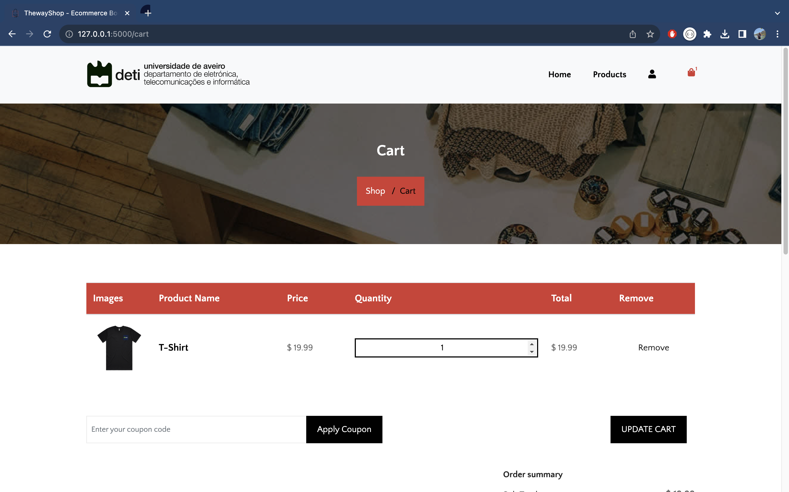
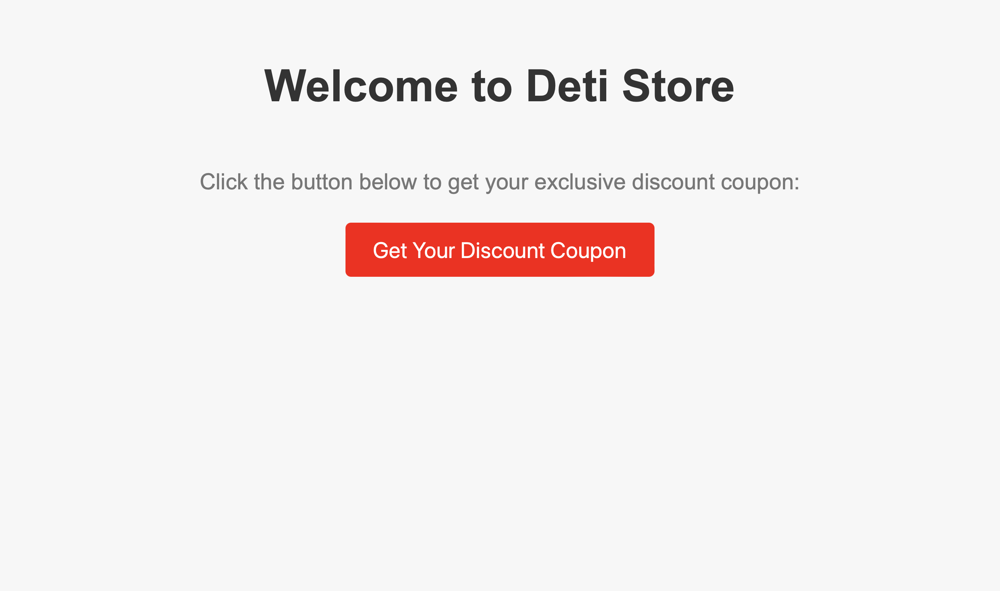
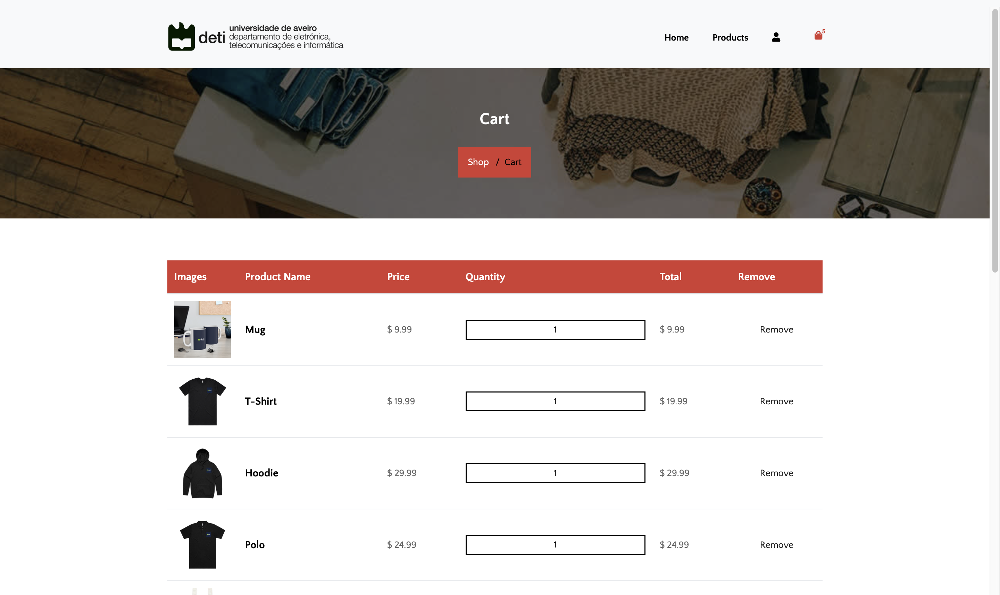
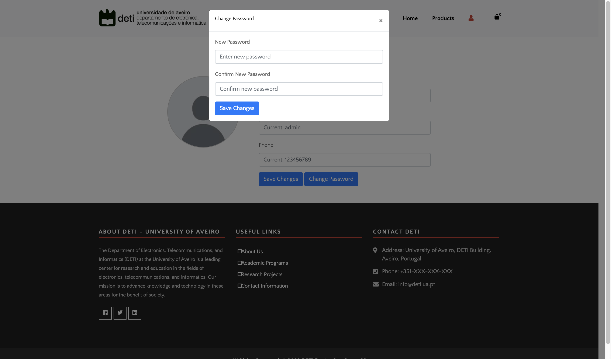
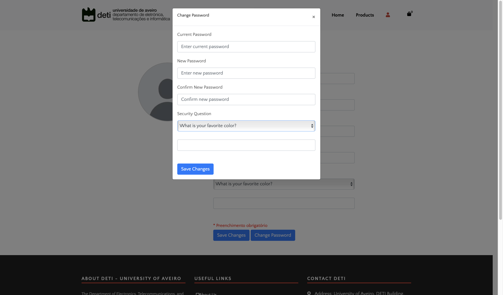

# DETI STORE

#### Project 1 - SIO

---

## Index

1. Introduction

2. Overview

3. Vulnerabilites

- CWE - 89
- CWE - 79
- CWE - 352
- CWE - 798
- CWE - 620
- CWE - 521
- CWE - 522
- CWE - 434

## 1. Introduction

The present report serves as documentation for Project 1 of SIO which intends to explore the possible vulnerabiilites, their consequences and their counters in a webapp for a ficitious online store: Deti Store.

---

## 2. Overview

To implement and counteract our selected vulnerabilites we used Flask: HTML with Boostrap on the frontend, data renderization with templating using Jinja2 and a SQLite database for data persistency on the backend.

## 3. Vulnerabilites

### CWE - 89 - Improper Neutralization of Special Elements used in an SQL Command ('SQL Injection')

##### Vector String: CVSS:3.0/AV:N/AC:H/PR:N/UI:N/S:U/C:H/I:H/A:H

##### Breakdown

| Metric | Value | Justification                                                                                                                  |
| ------ | ----- | ------------------------------------------------------------------------------------------------------------------------------ |
| AV     | N     | The vulnerability is exploitable from a remote network, such as the internet, without requiring user interaction.              |
| AC     | H     | An SQL injection attack does not require an easily guessable payload; in fact, it can be executed with sophisticated payloads. |
| PR     | N     | No privileges are required to exploit the vulnerability.                                                                       |
| UI     | N     | No user interaction is required to exploit the vulnerability.                                                                  |
| S      | U     | The vulnerability affects the security of the entire system, not just individual resources within the system.                  |
| C      | H     | An SQL injection attack can allow an attacker to access confidential information.                                              |
| I      | H     | SQL injection can allow an attacker to modify data, which affects data integrity.                                              |
| A      | H     | SQL injection can impact system availability.                                                                                  |

#### Abstract

SQL injection occurs when an attacker maliciously inserts SQL code into a web form input field with the intention of gaining unauthorized access to resources or manipulating data. In essence, an SQL query is a command that instructs a database to perform a specific action.

In a typical scenario, when a user enters their username and password into the respective text fields of a web form for authentication, these values are used in a SELECT query. The user is granted access if the provided information matches what's expected. Access is denied if there's no match.

However, many web forms lack adequate security measures to protect against unwanted input manipulation. In the absence of these safeguards, a hacker can exploit the input fields to send custom SQL commands to the database. This can allow them to download the entire database or interact with it in unauthorized ways.

As a result, SQL injection provides the attacker with unrestricted access to sensitive data, such as client details, personal information, proprietary information, trade secrets, and other confidential data. The ability to read, modify, or steal this sensitive information makes it easy for attackers to compromise a system and gain control over it.

#### Exploitation #1

In this case, SQL injection is possible in the password field of the login page, by entering an input that abuses the SQL quotation notation, for example ' or 1=1 -- as such:


#### Counteraction

Originally, the password is received and processed directly like so:

```python
query = text(
        "SELECT * FROM user WHERE username = '"
        + user
        + "' AND password = '"
        + key
        + "';"
    )

result = db.session.execute(query).fetchall()

if not result:
    flash("User not found!", "error")
    return redirect(url_for("auth.login"))

user = User.query.filter_by(username=user).first()
login_user(user)
```

To correct this, the **werkzeug** library was employed to process the password through hashing. Furthermore, **SQL Alchemy** was used to make sure that the password matches that which is associated with the user. In pratical terms, this translates into a guard clause like the following:

```python
user = User.query.filter_by(username=username).first()
if not user or not check_password_hash(user.password, key):
    flash("Please check your login details and try again.")
    return redirect(url_for("auth.login"))

login_user(user)
```

#### Exploitation #2

In this case, SQL injection is possible in the quantity field of the cart page, by entering an input that abuses the SQL quotation notation:


#### Counteraction

The vulnerability was present in the way we processed the quantity data in both the HTML and Python code. The original code allowed direct user input without proper validation and sanitization. In the HTML, the input field had the type "text," which did not restrict the input to numbers. In the Python code, the quantity was directly incorporated into an SQL query without any validation.
Originally, the quantity is received and processed directly like so:

```html
<td class="quantity-box">
  <input
    type="text"
    name="product_{{ product.id }}"
    value="{{ product_quantities[product.id] }}"
    min="0"
    step="1"
    class="c-input-text qty text"
  />
</td>
```

```python
for product_id in request.form:
        id = product_id.split("_")[1]
        query = text(
            "UPDATE cart_product SET quantity = "
            + request.form[product_id]
            + " WHERE cart_id = "
            + str(cart.id)
            + " AND product_id = "
            + str(id)
            + ""
        )
        db.session.execute(query)
        db.session.commit()
```

To mitigate this SQL injection vulnerability, we made critical changes to how we handle the quantity data in our application. In the HTML file, we restricted the input to numeric values only by setting the input type to "number." In the Python code, we validate the input to ensure it is a number before updating the database. If the input is not a number, we generate an error message and prevent any database updates.



```html
<td class="quantity-box">
  <input
    type="number"
    name="product_{{ product.id }}"
    value="{{ product_quantities[product.id] }}"
    min="0"
    step="1"
    class="c-input-text qty text"
  />
</td>
```

```python
for product_id in request.form:
    id = product_id.split("_")[1]

    if request.form[product_id].isnumeric() == False:
        flash("Invalid quantity.", "error")
        return redirect(url_for("cart.cart"))

    query = text(
        "UPDATE cart_product SET quantity = "
        + request.form[product_id]
        + " WHERE cart_id = "
        + str(cart.id)
        + " AND product_id = "
        + str(id)
        + ""
    )
    db.session.execute(query)
    db.session.commit()
```

#### Exploitation #3

In this case, SQL injection is possible in the search bar located in the wishlist page, by entering an input that forces content to be displayed into the Webpage. The input used in the image below is
`' UNION SELECT 0, username, password, isAdmin, null, null, null, null FROM user -- //`:


#### Counteraction

The issue came from how the Python code handled search input. In the original code, the user's input was directly incorporated into the SQL query for database usage without undergoing proper validation or sanitization:

```python
query = text("SELECT * FROM wishlist WHERE customer_id =" + str(current_user.id))
WishList = db.session.execute(query).fetchone()
query = text(
    "SELECT * FROM product WHERE id IN (SELECT product_id FROM wishlist_product WHERE wishlist_id = "
    + str(WishList.id)
    + ")"
    + " AND name LIKE '%"
    + search_value + "%'"
)

products = db.session.execute(query).fetchall()
```

To address this SQL injection vulnerability, we've implemented significant changes in how we handle search input. In the new approach, we first retrieve the products without directly searching for a pattern, unlike the previous method. Afterward, we filter the products based on the search value. This means it only checks whether the product names match the input or not, which helps mitigate the vulnerability:


```python
query = text("SELECT * FROM wishlist WHERE customer_id =" + str(current_user.id))
WishList = db.session.execute(query).fetchone()
query = text(
    "SELECT * FROM product WHERE id IN (SELECT product_id FROM wishlist_product WHERE wishlist_id = "
    + str(WishList.id)
    + ")"
)
products = db.session.execute(query).fetchall()

filtered_products = []
for product in products:
    if search_value.lower() in product.name.lower():
        filtered_products.append(product)
```

### CWE - 79 - Improper Neutralization of Input During Web Page Generation ('Cross-site Scripting')

##### Vector String: CVSS:3.1/AV:N/AC:H/PR:N/UI:R/S:C/C:H/I:H/A:H

##### Breakdown

| Metric | Value | Justification                                                                                                                                                                                                                                          |
| ------ | ----- | ------------------------------------------------------------------------------------------------------------------------------------------------------------------------------------------------------------------------------------------------------ |
| AV     | N     | Cross-site Scripting attacks typically occur over a network, such as the internet, and do not require physical access.                                                                                                                                 |
| AC     | H     | Cross-site Scripting attacks can be complex, especially when they require user interaction or social engineering to exploit. They often involve tricking users into executing malicious scripts.                                                       |
| PR     | N     | Attackers do not need specific privileges to exploit Cross-site Scripting vulnerabilities.                                                                                                                                                             |
| UI     | R     | Cross-site Scripting typically requires user interaction, such as tricking a user into clicking on a malicious link or executing a harmful script.                                                                                                     |
| S      | C     | Cross-site Scripting attacks generally do not change the scope of the system; they typically impact individual users or sessions rather than altering the security boundaries of the system.                                                           |
| C      | H     | The vulnerability allows an attacker to access sensitive information or steal user data, such as session tokens or sensitive personal information. This could lead to unauthorized access to the target user's account or other sensitive information. |
| I      | H     | Cross-site Scripting can impact the integrity of data, as malicious scripts can manipulate the content and functionality of web pages.                                                                                                                 |
| A      | H     | Cross-site Scripting attacks can impact the availability of a system, especially if they result in Denial of Service (DoS) conditions.                                                                                                                 |

#### Abstract

Cross-Site Scripting (XSS) attacks involve the insertion of malicious scripts into reliable websites, posing a significant threat to web security.

Attackers have the ability to transmit malicious code to users through web applications. Following the injection of this script, attackers gain the potential to carry out various malicious activities. This could involve the victim's computer unknowingly transmitting sensitive data to the attacker, including cookies containing valuable session details. In situations where the victim possesses administrative privileges over a website, the attacker can further exploit the situation by issuing harmful requests on the victim's behalf. This can result in significant damage to the website's integrity and security.

There are two types of XSS attacks: non-persistent (reflected) and persistent

- Non-persistent XSS, the most common one, involves the injection of a malicious script that is "reflected" off the web server as part of the server's response. In this scenario, the injected code travels to the vulnerable website, effectively "reflecting" the attack back to the victim's browser.
- In contrast, persistent XSS attacks invlove storing the malicious script on the victim's web server. This means the injected script is permanently retained within the web pages and is subsequently delivered to any user accessing the affected web page.

#### Exploitation #1

In the context of this project, an attacker can write a malicious script in the product's comment section, then adding the comment with the "Post Comment" button:


#### Counteraction

Originally, when the page loads, the comments are displayed with the their original values stored in the database:

```html
$(document).ready(function () { $.ajax({ url: "/get_comments/{{ product.id }}",
type: "GET", success: function (comments) { let comments_html = ""; for (let i =
0; i < comments.length; i++) { comments_html += `
<div class="card-body p-4">
  <div class="card-body p-4">
    <div class="d-flex flex-start">
      
      <div style="margin-left: 20px;">
        <h3 class="fw-bold mb-1">
          ` comments_html += comments[i].user_name; comments_html += `
        </h3>
        <div class="d-flex align-items-center mb-3">
          <p class="mb-0">
            ` comments_html += comments[i].date; comments_html += `
          </p>
        </div>
        <p class="mb-3">
          ` comments_html += comments[i].comment; comments_html += `
        </p>
        <div class="d-flex align-items-center">
          <p class="mb-0">
            ` for (let j = 0; j < comments[i].rating; j++) { comments_html +=
            `<i class="fas fa-star"></i>`; } comments_html += `
          </p>
        </div>
      </div>
    </div>
  </div>
</div>
<hr class="my-0" />
`; } $("#comments_div").html(comments_html); }, }); });
```


This can be avoided with the use of a simple function that replaces special characters with their HTML entities.

```html
function escapeHtml(unsafe) {
    return unsafe
        .replace(/&/g, "&amp;")
        .replace(/</g, "&lt;")
        .replace(/>/g, "&gt")
        .replace(/"/g, "&quot;")
        .replace(/'/g, "&#039;");
}

$(document).ready(function () {
  $.ajax({
    url: "/get_comments/{{ product.id }}",
    type: "GET",
    success: function (comments) {
      let comments_html = "";
      for (let i = 0; i < comments.length; i++) {
        comments_html += `
        <div class="card-body p-4">
            <div class="card-body p-4">
                <div class="d-flex flex-start">
                    
                    <div style="margin-left: 20px;">
                      <h3 class="fw-bold mb-1">`

                        comments_html += comments[i].user_name;

                      comments_html +=  `</h3>
                      <div class="d-flex align-items-center mb-3">
                          <p class="mb-0">`
                          comments_html += comments[i].date;
                          comments_html += `</p>
                      </div>
                      <p class="mb-3">`
                      comments_html += escapeHtml(comments[i].comment);
                      comments_html += `</p>
                      <div class="d-flex align-items-center">
                        <p class="mb-0">`

                        for (let j = 0; j < comments[i].rating; j++) {
                          comments_html += `<i class="fas fa-star"></i>`;
                        }

                        comments_html += `</p>
                      </div>
                    </div>
                </div>
            </div>
        </div>
        <hr class="my-0" />
        `;
      }
      $("#comments_div").html(comments_html);
    },
  });
});
```

#### Exploitation #2

In this case, a XSS attack is done when an attacker sends a link with a malicious script
to the user:


#### Counteraction

The shop page has the ability to search for products, accepting an argument called "search". The search value is then displayed with the products it filtered.
This vulnerability happens because the value displayed is not verified and sanitized:

```html
$(document).ready(function() { const urlParams = new
URLSearchParams(window.location.search); const searchQuery =
urlParams.get("search"); let returnValue = ""; if (searchQuery) { returnValue =
searchQuery; } $("#defaultValue").html(returnValue); });
```

To resolve this XSS vulnerability, we transform the inputed value into a literal string.


```html
$(document).ready(function() { const urlParams = new
URLSearchParams(window.location.search); const searchQuery =
urlParams.get("search"); if (searchQuery) {
$('#defaultValue').text(searchQuery); } });
```

### CWE - 352 - Cross-Site Request Forgery

##### Vector String: CVSS:3.1/AV:N/AC:L/PR:N/UI:R/S:C/C:N/I:H/A:N

##### Breakdown

| Metric | Value | Justification                                                                                                                                                                                                               |
| ------ | ----- | --------------------------------------------------------------------------------------------------------------------------------------------------------------------------------------------------------------------------- |
| AV     | N     | Cross-Site Request Forgery attacks can be conducted over a network, such as the internet, and do not require physical access.                                                                                               |
| AC     | L     | This vulnerability typically has a low attack complexity because it involves tricking a user into making an unintended request to a vulnerable web application, which can often be achieved with relatively simple tactics. |
| PR     | N     | Attackers do not need specific privileges to exploit Cross-Site Request Forgery vulnerabilities.                                                                                                                            |
| UI     | R     | Cross-Site Request Forgery attacks often require some level of user interaction, such as convincing a user to click on a malicious link or perform an action without their knowledge.                                       |
| S      | C     | Cross-Site Request Forgery attacks can change the scope of the system's security boundaries, as they involve tricking users into performing unintended actions within a web application.                                    |
| C      | N     | The exploitation of this vulnerability typically does not have a significant impact on the confidentiality of the system.                                                                                                   |
| I      | H     | Cross-Site Request Forgery attacks can have a high impact on the integrity of the system, as they can cause users to perform unauthorized actions or modify data without their consent.                                     |
| A      | N     | The vulnerability typically does not have a substantial impact on the availability of the system.                                                                                                                           |

#### Abstract

When a web server is designed to accept requests from clients without verifying their authenticity, it creates an opportunity for attackers to deceive a client into making unintentional requests to the web server, which are treated as legitimate requests. This can be achieved through various methods, including manipulating URLs, loading images, making XMLHttpRequests, or other techniques, ultimately leading to potential data exposure or unintended execution of code.

To mitigate and prevent Cross-Site Request Forgery (CSRF) attacks, web developers can implement several protective measures:

1. **Anti-CSRF Tokens**: Web applications can include anti-CSRF tokens in each request. These tokens are unique to each user session and are verified by the server to ensure that the request is legitimate. Without a valid token, the server rejects the request.
2. **Rate-Limiting Requests**: Developers can implement rate limiting to restrict the number of requests a user can make within a certain timeframe. This can help prevent a flood of malicious requests from an attacker.
3. **Same-Site Cookie Policies**: Utilizing same-site cookie attributes can be an effective defense against CSRF attacks. By setting cookies as "SameSite=Lax" or "SameSite=Strict," it restricts the scope of cookies to the same origin, making it harder for attackers to manipulate requests across different sites.

These measures collectively enhance the security of web applications and help safeguard against CSRF attacks, which aim to exploit the trust that a user's browser has in a particular website to perform unauthorized actions on their behalf.

#### Exploitation

For the purposes of this assignment, we chose to implement a fake, scam site, that would resemble the overall appearance of our real site, enough so that at least some more naïve users would fall for, as seen below:



In reality, it hides a malicious intent, implemented with the following hidden input, that is submitted when the user clicks the button:

```html
<form
  hidden
  id="hack"
  target="csrf-frame"
  action="http://127.0.0.1:5000/shop/add_to_cart/1"
  method="POST"
  autocomplete="off"
></form>

<iframe
  hidden
  name="csrf-frame"
  id="frame"
  width="1000px"
  height="1000px"
></iframe>
```

What the page does is pretend to offer free discount coupons for the store, but instead, it utilizes the user's stored cookies to insert fictitious products into the shopping cart, as can be observed at the bottom of the user's shopping list:



Here's a dramatization of how this vulnerability could be exploited in a real-world scenario:

In a real-world scenario, a user lands on our fraudulent website, lured by the illusion of receiving free discount coupons for their favorite store. Driven by curiosity and the promise of savings, they click on the enticing button to proceed. However, unbeknownst to them, their innocent click triggers a devious scheme. Upon returning to the genuine e-commerce site, the user is suddenly confronted with an alarming message injected by the attacker. To their utter dismay, a new set of imaginary products now populates their shopping cart, thanks to the exploitation of their stored cookies.


#### Counteraction

**Flask-WTF** is a widely used library for building web forms in Flask, and it comes with a built-in safeguard against CSRF (Cross-Site Request Forgery) attacks. This protection is implemented by adding a unique security token to every form created with the library.

When Flask-WTF generates a form, it discreetly includes a hidden field in the HTML code, containing a special token. This token is sent back to the server when the user submits the form. On the server side, Flask-WTF checks this token against the stored value and only processes the form if the token matches. This mechanism ensures that, even if an attacker manages to trick a user into submitting a form, the attack is thwarted because the attacker doesn't possess the correct anti-CSRF token.

In simple terms, this means that attackers can't submit any data unless they have access to the specific page where the data should be submitted.

To apply this security measure, all you need to do is import the Flask-WTF library and add a hidden input field as shown below in your form code:

```html
<form method="POST" action="/product/add_to_cart/{{ product.id }}">
  <input type="hidden" name="csrf_token" value="{{ csrf_token() }}" />
  <button class="btn btn-success" style="margin-right: 5px;">
    Add To Cart
  </button>
    
  <div class="alert alert-danger" role="alert">{{ message }}</div>
    
</form>
```

This way, your application becomes more resilient to CSRF attacks, providing an additional layer of security.

### CWE - 798 - Use of Hard-coded Credentials

##### Vector String: CVSS:3.1/AV:A/AC:H/PR:H/UI:N/S:U/C:H/I:H/A:N

##### Breakdown

| Metric | Value | Justification                                                                                                                                                                              |
| ------ | ----- | ------------------------------------------------------------------------------------------------------------------------------------------------------------------------------------------ |
| AV     | A     | This vulnerability is typically exploitable from an adjacent network, like a local network or system, where an attacker can directly access the resources.                                 |
| AC     | H     | The complexity of exploiting the use of hard-coded credentials is typically high because it often involves sophisticated skills, tools, or conditions to extract or use these credentials. |
| PR     | H     | To exploit this vulnerability, attackers often need elevated privileges, such as administrative access.                                                                                    |
| UI     | N     | No user interaction is required to exploit the vulnerability since hard-coded credentials are embedded directly in the code.                                                               |
| S      | U     | The vulnerability's exploitation does not change the scope of the system's security boundaries.                                                                                            |
| C      | H     | The use of hard-coded credentials can lead to unauthorized access to sensitive information, resulting in a high impact on confidentiality.                                                 |
| I      | H     | Unauthorized access via hard-coded credentials can lead to unauthorized modifications or alterations of system data, resulting in a high impact on integrity.                              |
| A      | N     | The vulnerability typically does not have a substantial impact on the availability of the system.                                                                                          |

#### Abstract

Hard-coded credentials represent a significant security vulnerability that can enable attackers to bypass the authentication mechanisms configured by software administrators. This vulnerability is often elusive for system administrators, and even if detected, rectifying it can be an insurmountable challenge, sometimes necessitating the complete disabling of the affected product.

In this project, we're specifically focusing on the inbound variation of this vulnerability, where a default administrator account is created with a hardcoded, simplistic password embedded in the product. This password remains identical across all installations, and administrators are often unable to modify or deactivate it without manual intervention, like editing the application's code or updating the software. If this password becomes known or is published (which is unfortunately common on the internet), anyone possessing it can gain unauthorized access to the product. Furthermore, because all instances of the program share the same password, even across different organizations, it opens the door to large-scale attacks like worms.

To mitigate this security risk, it is imperative to avoid using hard-coded credentials in software development. Instead, administrators should be compelled to establish unique and robust passwords for each installation of the product, and the software should be designed to securely store these credentials. This approach helps in averting unauthorized access and limiting the potential fallout of a security breach. Additionally, conducting regular security audits and testing is essential to uncover and rectify any instances of hard-coded credentials within the product. This proactive approach bolsters the overall security posture of the software.

#### Exploitation

During development, several test users can be created and left, by accident, in the database tables, for example:

```
username: admin

password: admin123

```

#### Counteraction

Our approach to addressing this issue involves the development and implementation of a script designed to perform a database sanity check during the deployment process. This ensures that the product is deployed in a secure and clean state. Here is how our implementation works:

1. **Script Creation**: We have created a dedicated script for this purpose. This script is designed to be executed during the deployment phase.

2. **Database Inspection**: The script examines the database to identify any default administrator accounts with hard-coded passwords.

3. **Password Update**: If the script detects default administrator accounts, it deletes them. It then prompts the administrator to create a new password for the administrator account.

4. **Deployment Continues**: Once the script completes its database sanity check, the deployment process can proceed with the assurance that the product is in a more secure and compliant state.

By incorporating this script into the deployment workflow, we reduce the risk associated with hard-coded credentials and other security vulnerabilities. This approach helps to ensure that each deployment is carried out with security in mind, reducing the potential for unauthorized access and other security threats. Regular execution of this script as part of the deployment process maintains the ongoing security and integrity of the product.

```python
def check_db_security(db):
    query = text("SELECT username FROM user WHERE isAdmin = True;")
    result = db.session.execute(query).fetchall()
    usernames = [username[0] for username in result]

    for username in usernames:
        query = text("SELECT * FROM user WHERE username = '" + username + "';")
        result = db.session.execute(query).fetchall()

        print("User " + username + " found!")
        query = text("DELETE FROM user WHERE username = '" + username + "';")
        db.session.execute(query)
        db.session.commit()
        print("Deleted user: " + username)
        print("-------------------")
```

### CWE - 620 - Unverified Password Change

##### Vector String: CVSS:3.1/AV:N/AC:L/PR:N/UI:R/S:U/C:H/I:H/A:N

##### Breakdown

| Metric | Value | Justification                                                                                                                                                                                         |
| ------ | ----- | ----------------------------------------------------------------------------------------------------------------------------------------------------------------------------------------------------- |
| AV     | N     | The vulnerability is not exploitable via the network, as it does not allow for remote exploitation.                                                                                                   |
| AC     | L     | The attack complexity is relatively low because it does not require advanced techniques or conditions to exploit.                                                                                     |
| PR     | N     | The attacker does not need specific privileges to exploit the vulnerability.                                                                                                                          |
| UI     | R     | Some level of user interaction is typically necessary for this vulnerability to be exploited. For instance, an attacker might need to trick a user into changing their password without verification. |
| S      | U     | The impact of the vulnerability does not change the scope of the system's security boundaries.                                                                                                        |
| C      | H     | Unauthorized password changes can lead to unauthorized access to sensitive data, which has a high impact on confidentiality.                                                                          |
| I      | H     | Unauthorized password changes can result in unauthorized modifications or alterations of system data, impacting system integrity to a high degree.                                                    |
| A      | N     | The vulnerability does not have a substantial impact on system availability.                                                                                                                          |

#### Abstract

The product does not require knowledge of the original password or the utilization of an alternative form of authentication when resetting a user's password. While this approach can provide convenience for users, it introduces a security vulnerability that attackers may exploit.

An attacker could potentially exploit this vulnerability to change passwords for other user accounts, effectively gaining unauthorized access and acquiring the privileges associated with those compromised accounts. This scenario can lead to significant security breaches and unauthorized activities within the system.

#### Exploitation

Not requesting the user's current password when editing their profile can create a security vulnerability. In such a scenario, a malicious actor who gains access to the user's current session could potentially exploit this vulnerability to lock the user out of their own account. This could be done by making unauthorized changes to the user's profile settings, such as changing the password or email address.



#### Counteraction

Introducing a field that necessitates the user to input their current password not only ensures that their account isn't currently compromised but also adds an additional layer of security. Additionally, incorporating a security question as part of the authentication process further enhances the account's protection. This combination of measures safeguards the user's account from unauthorized access and helps verify the user's identity before making any profile changes.



### CWE - 521 - Weak Password Requirements

##### Vector String: CVSS:3.1/AV:N/AC:L/PR:N/UI:R/S:U/C:H/I:H/A:N

##### Breakdown

| Metric | Value | Justification                                                                                                                                                                                     |
| ------ | ----- | ------------------------------------------------------------------------------------------------------------------------------------------------------------------------------------------------- |
| AV     | N     | The vulnerability is not directly exploitable via the network and does not allow for remote exploitation.                                                                                         |
| AC     | L     | The attack complexity is typically low because exploiting weak password requirements doesn't usually require advanced techniques or conditions.                                                   |
| PR     | N     | The attacker does not need specific privileges to exploit the vulnerability.                                                                                                                      |
| UI     | R     | Some level of user interaction may be necessary for this vulnerability to be exploited, such as an attacker requiring a user to choose a weak password due to insufficient password requirements. |
| S      | U     | The impact of the vulnerability does not change the scope of the system's security boundaries.                                                                                                    |
| C      | H     | Weak password requirements can lead to unauthorized access to sensitive data, resulting in a high impact on confidentiality.                                                                      |
| I      | H     | Weak password requirements can lead to unauthorized modifications or alterations of system data, impacting system integrity to a high degree.                                                     |
| A      | N     | The vulnerability typically does not have a substantial impact on system availability.                                                                                                            |

#### Abstract

Authentication systems often rely on a user's memorized secret, typically referred to as a password, to establish and confirm their identity. Therefore, it is crucial that these passwords are sufficiently strong and intricate to make it challenging for potential attackers to guess or breach. The specific criteria for password complexity can differ based on the type of system being protected. The key is to select appropriate password requirements and ensure they are effectively implemented to enhance the overall security of the authentication mechanism.

#### Exploitation

The vulnerability exploitation essentially centers around the idea that a straightforward or simple password is easy to crack, making it a risky choice to permit.

#### Counteraction

To mitigate this weakness, we take a straightforward approach: we disallow users from using weak passwords. We achieve this by rejecting passwords that exhibit characteristics commonly associated with vulnerability, such as being shorter than 8 characters, lacking a digit, lacking a mix of uppercase and lowercase letters, or lacking a special symbol. We enforce these criteria using conditional `if` statements in our password validation process.

```python
if len(key) < 8:
    flash("A senha deve ter pelo menos 8 caracteres")
    return redirect(url_for("register.regist"))
elif not any(char.isdigit() for char in key):
    flash("A senha deve ter pelo menos um número")
    return redirect(url_for("register.regist"))
elif not any(char.isupper() for char in key):
    flash("A senha deve ter pelo menos uma letra maiúscula")
    return redirect(url_for("register.regist"))
elif not any(char.islower() for char in key):
    flash("A senha deve ter pelo menos uma letra minúscula")
    return redirect(url_for("register.regist"))
elif not any(char in "~`! @#$%^&*()_-+={[}]|\:;\"'<,>.?/" for char in key):
    flash("A senha deve ter pelo menos um caractere especial")
    return redirect(url_for("register.regist"))
```

### CWE - 522 - Insufficiently Protected Credentials

##### Vector String: CVSS:3.1/AV:N/AC:L/PR:N/UI:N/S:U/C:H/I:H/A:N

##### Breakdown

| Metric | Value | Justification                                                                                                                                           |
| ------ | ----- | ------------------------------------------------------------------------------------------------------------------------------------------------------- |
| AV     | N     | The vulnerability is not directly exploitable via the network and does not allow for remote exploitation.                                               |
| AC     | L     | The attack complexity is typically low because exploiting insufficiently protected credentials may not require advanced techniques or conditions.       |
| PR     | N     | The attacker does not need specific privileges to exploit the vulnerability.                                                                            |
| UI     | N     | No user interaction is required to exploit the vulnerability as it relates to insufficiently protected credentials.                                     |
| S      | U     | The impact of the vulnerability does not change the scope of the system's security boundaries.                                                          |
| C      | H     | Insufficiently protected credentials can lead to unauthorized access to sensitive data, resulting in a high impact on confidentiality.                  |
| I      | H     | Insufficiently protected credentials can lead to unauthorized modifications or alterations of system data, impacting system integrity to a high degree. |
| A      | N     | The vulnerability typically does not have a substantial impact on system availability.                                                                  |

#### Abstract

The website transmits or stores authentication credentials, but it does so in an insecure manner, making it susceptible to unauthorized monitoring or extraction.

#### Exploitation

While editing the user profile, it's possible to change the field in the URL that corresponds to the user's ID to the ID of another existing user. This action grants access to the editing page of the targeted user's profile.


#### Counteraction

As mentioned earlier, the URL includes a field related to the user's ID. This is because the current user's ID is passed as an argument within the routing system, as follows:

```python
@profile.route("/profile/<int:id>", methods=["GET"])
@login_required
def changeProfile(id):
```

To mitigate this issue, the URL for this page no longer includes the ID field, and this argument is omitted from the routing process. Consequently, it's no longer considered, preventing a user from accessing other editing pages that could potentially alter third-party data, like this:

```python
@profile.route("/edit_profile", methods=["GET"])
@login_required
def changeProfile():
```

### CWE-434 - Unrestricted Upload of File with Dangerous Type

##### Vector String: CVSS:3.1/AV:N/AC:L/PR:N/UI:R/S:U/C:H/I:H/A:N

##### Breakdown

| Metric | Value | Justification                                                                                                                                                 |
| ------ | ----- | ------------------------------------------------------------------------------------------------------------------------------------------------------------- |
| AV     | N     | The vulnerability is not directly exploitable via the network and does not allow for remote exploitation.                                                     |
| AC     | L     | The attack complexity is typically low because exploiting the unrestricted upload of dangerous files may not require advanced techniques or conditions.       |
| PR     | N     | The attacker does not need specific privileges to exploit the vulnerability.                                                                                  |
| UI     | R     | Some level of user interaction may be necessary for this vulnerability to be exploited, such as an attacker enticing a user to upload a dangerous file.       |
| S      | U     | The impact of the vulnerability does not change the scope of the system's security boundaries.                                                                |
| C      | H     | The unrestricted upload of dangerous files can lead to unauthorized access to sensitive data, resulting in a high impact on confidentiality.                  |
| I      | H     | The unrestricted upload of dangerous files can lead to unauthorized modifications or alterations of system data, impacting system integrity to a high degree. |
| A      | N     | The vulnerability typically does not have a substantial impact on system availability.                                                                        |

#### Abstract

The software allows for the upload or transfer of file types that carry inherent security risks, and these files can be automatically processed within the product's environment.

#### Exploitation

During the process of editing a user's profile, the website permits the upload of files, with the intention that they should be in PNG or JPEG file formats. However, this validation relies on the user's cooperation, leaving a potential vulnerability where a malicious user could upload a file of a dangerous type, capable of disrupting the application's regular operation.

In the following example, the user submits a file in JPG format, and as expected, the system accepts it, potentially creating a security risk.


#### Counteraction

To address this issue, we have implemented a straightforward guard clause to prevent the upload of any file type other than PNG or JPEG. This helps ensure that only safe and permitted file types can be uploaded.

```python
if profile_picture.filename.endswith(
    ".png"
) or profile_picture.filename.endswith(".jpeg"):
    try:
        profile_picture.save(
            os.path.join("static/images", profile_picture.filename)
        )
        new_user = User(
            username=user,
            password=generate_password_hash(key),
            name=nome,
            email=email,
            phone=phone,
            image=profile_picture.filename,
            security_question=security_question,
        )
    except:
        flash("Erro ao fazer upload da imagem!", category="danger")
        return redirect(url_for("register.regist"))
else:
    flash(
        "Por favor insira uma imagem com extensão .png ou .jpeg",
        category="danger",
    )
    return redirect(url_for("register.regist"))
```

After implementing this change, the system's behavior is as follows:


---

## 4. Final Considerations

In addition to addressing the previously mentioned attack vectors, we made an effort to tackle CWE-1336, which is commonly referred to as 'Template Injection.' However, this vulnerability was already mitigated in a prior version of Jinja2, the template engine used in the project.

This project significantly raised our awareness of the critical importance of developing applications and services with a strong emphasis on security. It underscored the risks associated with neglecting security considerations in software development, emphasizing the need to prioritize security throughout the entire development process.
